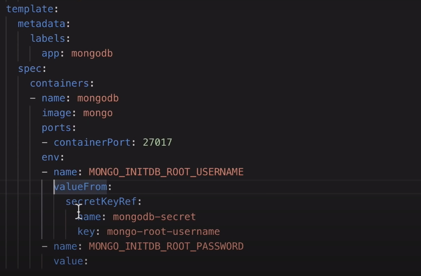
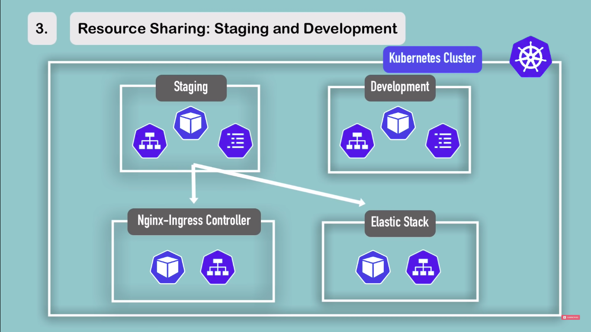
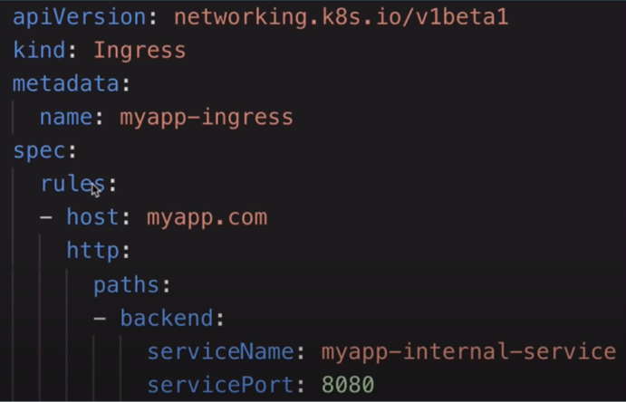
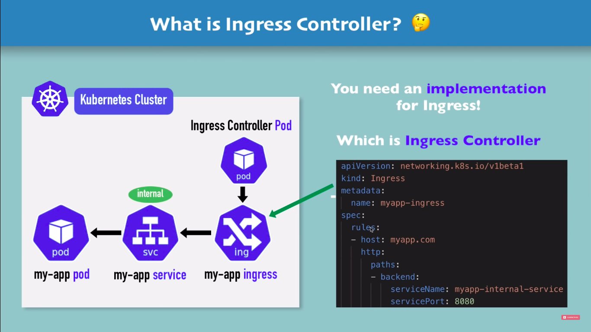

## Containers Overview
* In Linux, the various flavours are nothing but different softwares on top of a common OS kernel
* So, containers of any linux distro can be run on top of a linux distro
* But containers of other OS like windows cannot be launched on top of Linux as the host OS, because Windows will use a different OS kernel to interact with the hardware 

### Containers vs VM

* VMs don't rely on the underlying OS or Kernel. So, they can have any OS
* Hypervisor is used for virtualization

## Kubernetes
* Kuberenetes is a container orchestration technology. It is used to manage and deploy containers and scale according to needs
### Terminology
- **Nodes** 
    * A machine that has kubernetes installed
    * A worker machine that launches containers 
    * Previously known as minions

> Kubernetes is also called K8
- **Cluster** 
    * A group of nodes with a master node. Other nodes are also referred as slave/worker nodes
        * A master node watches over the worker nodes and is responsible for ochestration of the containers in those nodes
    * Even if a node fails in your cluster, your application is still accessible from the other nodes
    * Having multiple nodes help in sharing load aswell

### Components

When you install kubernetes, it comes along with:
* **API Server** 
    * The frontend. The CLI, UI .. all talk to the API to interact with k8 cluster  
* **etcd** 
    * Used to store Key-values. Contains info that is used to manage the cluster
* **Scheduler**
    * Responsible for distributing containers across multiple nodes
* **Controller**
    * Responsible for monitoring the nodes, containers and endpoints. Launches new units if the current one goes down
* **Container Runtime**
    * The underlying software that is used to launch containers (Docker) 
* **Kubelet** 
    * The agent that runs on each node in the cluster. Responsible for making sure the containers are running on the nodes as expected


### Master vs Worker Nodes

* A node running the _API server_ makes it a master node and the node running the _kubelet_ agent makes it a worker node
* Worker nodes should have 3 components installed in it:
    * **Container Runtime**
    * **Kubelet** - for spinning up pods and managing it
    * **Kube Proxy** - for proxying requests to pods efficiently 
* Master nodes must have 4 components in it:
    * **API server** - The user interacts with the api server (through a GUI or CLI) to manage the K8s cluster 
    * **Scheduler** - Analyzes all nodes and determines on which node is the scheduled pod is going to be deployed 
    * **Controller** - Manages the state of the pods. If any pod is down, controller is responsible to notify
    * **etcd** - Key-Value storage. Its the brain of the cluster. Contains the entire information of the cluster. Other components write to and read from this storage


> Kubelet is what actually launches the new pod 
<br/>
* Master nodes have less workload therefore consume less resources (CPU, RAM ...)
* Worker nodes are the nodes that actually perform the job, so they need more resources

### kubectl
* CTL stands for control/command-line-tool
* Command Line tool deploying and managing application on a kubernetes cluster

### minikube
* A one node K8s cluster for development purposes

## Pods
* A pod is a kubernetes object that holds the container. So, a pod is an instance of your application

* To scale up, you add more pods (instances of your app) to your node

### Multi-container pods
* You generally don't, but CAN have more than one container in a pod
* Usually these containers would be helping containers for your main application (maybe like a MySQL container for your app)
* Containers within a pod share same volume (storage) and are a part of same network space, so can communicate with each other


## Other components
### ConfigMap & Secrets
* **ConfigMap** is nothing but like an external env file that contains all the env variables
* It is attached to the pod, so that the applicaion instance can read from it
* It is not advised to store secrets like credentials in ConfigMap because it is stored as plain text. So, for this purpose k8s offers a component called **Secrets** for storing secrets
* Data in _Secrets_ is base64 encoded (not plain text)

### Secret Config File

* This a sample configuration file for a secret 
* `type: Opaque` means that it is a key-value pair type of secret
* The values for the secret must be base64 encoded. You can do that in the terminal by:
    ```
    echo -n "yourtext" | base64
    ```
* This secret config file must be created first before it is referenced in any other config files
___

* This is how the secret is referenced in other config files
* `mongodb-secret` is the name of the secret (k8 component) that was created. It can contain multiple secrets. One of those secret is `mongodb-root-username`
### Volumes
* K8s does not manage data persistency by default. When the pods go down, the data aswell goes down. So, we use Volumes. It can be visualized as an external hardware plugged into the K8s cluster
* The volume could be a local storage on a node or external storage (maybe in the cloud)

### StatefulSet
* You use deployment to deploy stateless application and use **Stateful set** to deploy stateful applications like database
* You cannot replicate a DB using deployment because, if there are multiple replicas of DBs, then they must be in sync. Stateful Set takes care of this
* But, setting up DBs with statefulSet is tedious, so usually DBs are usually maintained outside of the K8s cluster 

## Namespaces
* Namespaces are like venvs within a k8s cluster
* There are 4 namespaces created by k8s by default and one by minikube aswell
    * default 
    * kube-system
    * kube-public
    * kube-node-lease
    * kubernetes-dashboard (minikube)
* You can create your own namespaces aswell
* You can use namespaces to :
    * Group your resources 
    * Avoid conflicts between teams working in the same cluster
    * Limit Resources (CPU, RAM ..) for namespaces
    * Using same resources (grouped in namespace) for multiple environments like staging and development
    
<br/>
* You cannot access some resources like ConfigMap and Secrets from other namespaces. You can access services from other namespaces
* Some resources cannot be confined to a namespace and live globally across the cluster. Example: Volumes
* You can find a list of it by
    ```
    kubectl api-resources --namespaced=false
    kubectl api-resources --namespaced=true
    ```

### Create Resources in your namespace
* You mention it under the `metadata` section of your config file for your resource
    ```yaml
    metadata:
        name: mysql-configmap
        namespace: my-namespace
    ```
* To get the list of resources in your namespacce, you'll have to use `-n` flag 
    ```
    kubectl get configmap -n my-namespace
    ```
* Instead of using it everytime, if you are regularly working with that specific namespace, you can make use of a tool called `kubens` to make your namespace the active namespace
> https://github.com/ahmetb/kubectx#installation
## YAML


## YAML in K8
```yaml
apiVersion:
kind:
metadata:
spec:
```
* These four are the required fields for a k8 configuration file
    * `kind` is the kind of component you are creating - a pod, replicaset, or ...
    * `metadata` can have only the fields expected by k8. We cannot add our own
    * `spec` is the specification for your component
    * `apiVersion` is the api version according to the _kind_ of component


### Sample YAML file
```yml
apiVersion: v1
kind: Pod
metadata:
    name: myapp-pod
    labels:
        app: myapp
        type: front-end
spec:
    containers:
        -   name: nginx-container
            image: nginx
```
* Use `kubectl create -f <yamlfile>` or `kubectl apply -f <yamlfile>` command to create the pod

## ReplicaController & ReplicaSet
* **Replica Controller** is used to monitor the pods. Incase any of the pods fail, RC creates a new pod

* It is also used to load balance among the pods
* A single RC can span across multiple nodes in the cluster


* The `template` section is to specify the template of the pod that the RC needs to launch
    * If the pods are already present (with matching labels), then no new pods will be created. But, if any of the pods fail, the new pods are launch from the mentioned `template` 
> Replicas = Pods   
### Replica Set

* **Replica Set** is just the newer version of _Replica Controller_ with minor differences
* The actual major difference in replica set is that you need to specify the `selectors` in the definition file. This actually is used to monitor pods that were already created with the same label.
* The label specified in the `selectors` section and the `template` of the pod must be the same.   
* You can use the `selectors` property in Replica Controller aswell but if you skip it, it by default takes the label of the pod you mentioned in the `template`
* It is recommended to use Replica Set than Replica Controller as RC is old 

> Deleting a replicaset also deletes the pods managed by it
### Scaling
* You can scale to match the workload by replacing the `replicas` field with the desire number in your definition file and using the `kubectl replace -f replicaset-def.yaml` command. OR with the `scale` command
```
kubectl scale --replicas=6 -f replicaset-def.yaml
OR
kubectl scale --replicas=6 replicaset myapp-replicaset
```
* Scales replicas to 6, but does not change the actual definition in the file
* `myapp-replicaset` is the name of the replicaset you define in your definition file

## Deployments

* Deployment is what you usually use to deploy applications. It has extra features like, rollback to a particular version, update to a newer version and some more..
* Deployment automatically creates a replica set

* The definition file for deployment is similar to that of a replica set except for the `kind` field
* The `template` is for the template of the pod 
* `selector` here is the selector for the replica set. If you create another RS with the same label it won't create new pods
> selector groups k8 objects based on matching labels

### Update and Rollback 
* _Rollout_ is something that is carried out on every deployment. It basically creates a new revision of the deployment
> Deployment in a versioned manner is called a rollout. Rollout history is like your commit history in git
* You can check the rollout status of your deployment using `kubectl rollout status deployment/myapp-deployment` and rollout history using `kubectl rollout history deployment/myapp-deployment`
___
* During a new deployment, a new replicaset is created and the pods managed by the old replicaset is shut down. 
* The old replicaset still remains, and is used incase if you want to rollback to a previous version

### Deployment Strategy

* In **Recreate** deployment strategy, all the instances of the application is brought down and the new version of the application is launched altogether
* The downside of _Recreate_ deployment strategy is application downtime 
* In **Rolling Update** strategy, the older version of the application is stopped instance by instance while the new version is launched simultaneously (instance by instance)
* Rolling Update is the default deployment strat in k8
### Deployment vs ReplicaSet
* Deployment has extra features like update and rollback
* Deployment internally uses replicasets
## Networking in Kubernetes
* Every node has an IP address
* In Kuberenetes, IP address is assgined to a pod (not the container)
* Pods within a node can communicate with each other using their IP
* Pods are assigned a new IP when they are recreated (ie- pods are ephemeral)
* Kubernetes does not set up networking by default in a multi-node cluster. It expects us to do so that meets this criteria:
    * All containers/PODs can communicate to one another without NAT
    * All nodes can communicate with all containers and without NAT
* There are many additional 3rd party applications available that can help you to set up networking in k8
<br/>

* Here, the node is running on the same machine as the user. So they have similar IP addresses 
* But the pods inside the node are on a different network (virtual network). So they have different IP addresses

## Services in Kubernetes
* Services in Kubernetes allows communication with other k8 components
    * Could be with applications outside k8 (OR) maybe with application that runs on a node part of a different cluster
 

* Three types of Services:
    * NodePort
    * ClusterIP
    * Load Balancer
> ClusterIP is the default type of service 
### NodePort
* It listens to a port on a node and forwards the requests to pods in that node
* The port that it listens on the node is called a **node port**. The port on the Service is called port. The port on the pod is called target port

* NodePort can only be in the range 30000-32767


* It chooses the pods to forward requests to, by the `selector` property in the definition file
* So when there are multiple pods with the same label, the Service forwards requests to multiple pods
> Note here that there is no `matchLabels` under `selector` field 
<br/>
* The only required parameter in the `ports` section is `port`
    * If nodePort is not specified, a free port is assigned from the range
    * If targetPort is not specified, it is assumed to be the `port` (port on the Service) 
<br/>
* In a multi-node cluster, the **service** automatically spans across all the nodes without any additional setup


* In this example, the application _voting-app_ is accessible across all the four nodes with NodePort because, the k8 Service by default spans across all the nodes 
> Note: NodePort is generally not used in production, rather we use Ingress or LoadBalancer
### ClusterIP
* The IPs on the pods are not static. If a pod fails, a new pod is launched with a new IP
* So, to have common IP for communication for a set of pods, we create a **ClusterIP**
* ClusterIP is an interface that is the gateway to communicate with a set of pods


* Other pods can communicate using the Cluster IP _or_ the service name

### LoadBalancer
* The `LoadBalancer` service actually leverages the native load balancer of the cloud (only supported providers like AWS, GCP, Azure ...)
* If you are setting up a seperate server for external load balancing, the k8 `LoadBalancer` service would not have any effect. It will just act as a NodePort Service


## Ingress
* It is another component offered by K8s
* Instead of exposing an IP and a port by a nodePort service, with Ingress we can receive requests from a domain and route it to a service internally

### Config file

* Here, any request that is received to `myapp.com` is routed to `myapp-internal-service`
* `paths` are the routes. Ex: `myapp.com/products`, `myapp.com/users`
* The `http` here siginfies the protocol (http) that the incoming request is transferred to.
* The `host` must be a valid domain name and should be mapped to an Node's IP address which is the entrypoint to the K8s cluster
* You can also have TLS certificates configured in Ingress
> Ingress YAML config file - https://gitlab.com/nanuchi/youtube-tutorial-series/-/blob/master/kubernetes-ingress/dashboard-ingress.yaml
### Ingress Controller
* Ingress Component alone wouldn't work. We need an Ingress Controller to validate and process the routing rules

* Ingress controller is put to use by using third-part implementations
* K8s offers its own IC - _K8s Nginx Ingress Controller_
* You do this in minikube by:
    ```
    minikube addons enable ingress
    ```

## Helm
* Helm is a package manager for Kubernetes
* We can make use of YAML files publicly available in a repository like [Helm Hub](https://artifacthub.io/) 
* These bundles of YAML files are called _Helm Chart_
* You can also create own Helm Charts for your application and use it to deploy in multiple K8s clusters or environments

* Helm is also used as a templating engine. Meaning, we can create a base template YAML file and have placeholders which can change (like Jinja templating language). So, other YAML files inheriting the base YAML file will only need to fill in the dynamic placeholder values